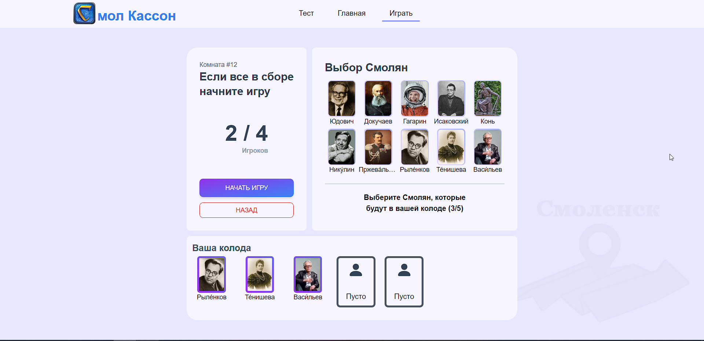
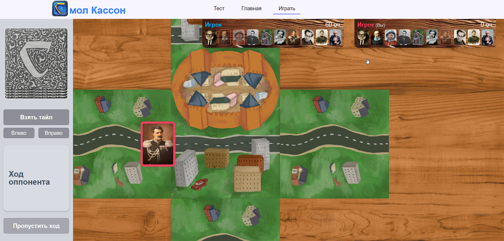
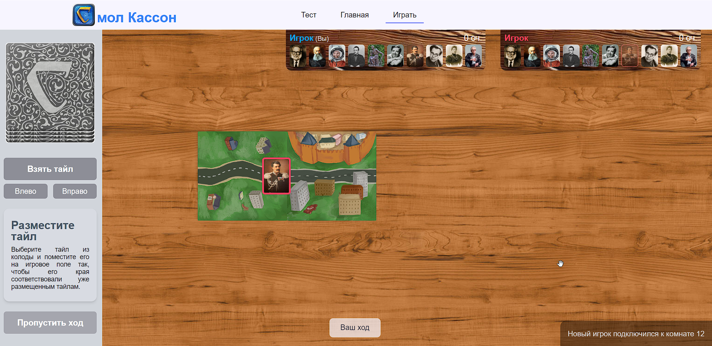
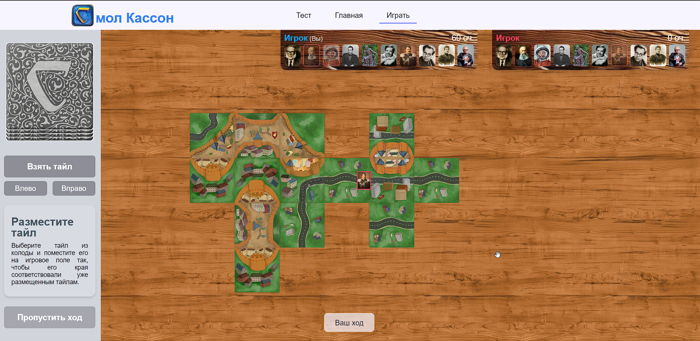

# SmolCassonne - Carcassonne about Smolensk
Online board game in Smolensk style with multiplayer.

# How to get started?
1. Clone repository to your PC:
`git clone https://github.com/Color-Kat/SmolCassonne.git ./your-directory`
2. `cd ./client`
3. `npm i` - install dependencies for client
4. `npm run dev` - run vite in dev mode
5. `cd ../server`
6. `npm i` - install dependencies for server
7. `npm run start` - run server

Не успели до конца доделать выбор Смолян, выбранные игроками смоляне не синхронизируется между ними. Сейчас работаем над этим
После добавления большего количества Смолян не успели настроить их бонусы

